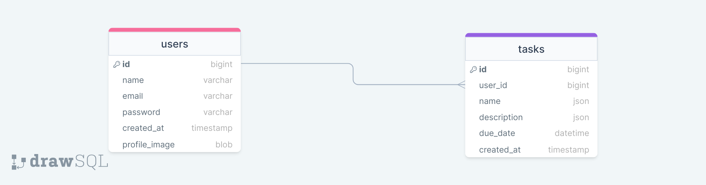

<p align="center"><a href="https://laravel.com" target="_blank"></a></p>

## About Laravel Task Manager

This Laravel application is a simple and intuitive task management system. It allows users to manage their daily tasks with features like adding, editing, deleting, and sorting tasks. It also supports localization for English and Georgian languages.

## Features

-   User authentication with login.
-   CRUD operations for task management.
-   Task sorting and filtering, including viewing overdue tasks.
-   Localization support for English and Georgian.
-   Profile management with the ability to update user details and password.
-   Upload and manage profile and cover images with default placeholders.

## Prerequisites

Before you begin, ensure you meet the following requirements:

-   PHP @8.0 and up
-   MySQL@8 and up
-   Composer for managing PHP dependencies
-   npm for managing front-end assets

## Tech Stack

-   Laravel 10
-   Alpine.js
-   Tailwind CSS
-   Spatie Translatable - package for translation

## Getting Started

1. First of all you need to clone Task Manager repository from github:

```
 git clone git@github.com:RedberryInternship/task-manager-irakli-ketchekmadze.git
```

2. Next step requires you to run composer install in order to install all the dependencies.

```
   composer install
```

3. after you have installed all the PHP dependencies, it's time to install all the JS dependencies:

```
   npm install
```

and also:

```
npm run dev
```

4. Now we need to set our env file. Go to the root of your project and execute this command.

```
 cp .env.example .env
```

And now you should provide .env file all the necessary environment variables:

MYSQL:

DB_CONNECTION=mysql

DB_HOST=127.0.0.1

DB_PORT=3306

DB_DATABASE=**\***

DB_USERNAME=**\***

DB_PASSWORD=**\***

after setting up .env file, execute:

```
php artisan config:cache
```

in order to cache environment variables.

## Migrations

if you've completed getting started section, then migrating database if fairly simple process, just execute:

```
php artisan migrate
```

## Development

You can run Laravel's built-in development server by executing:

```
php artisan serve
```

when working on JS you may run:

```
npm run dev
```

## Project Structure

```
├─── app
│ ├─── Console
│ ├─── Exceptions
│ ├─── Http
│ ├─── Providers
│ │... Models
├─── bootstrap
├─── config
├─── database
├─── lang
├─── public
├─── resources
├─── routes
├─── storage
├─── tests
```

-   .env
-   .env.example
-   artisan
-   composer.json
-   package.json
-   phpunit.xml
-   .php-cs-fixer.php
-   tailwind.config.js
-   postcss.config.js

For more information about project standards, take a look at these docs:

<a href="https://laravel.com/docs/10.x">Laravel</a>

## Database

<a href="https://drawsql.app/teams/irakli/diagrams/tasks">Link to DrawSQL</a>


# task-manager
# task-manager
